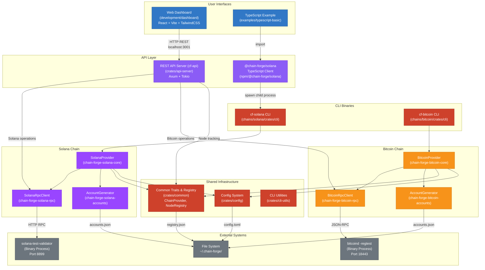
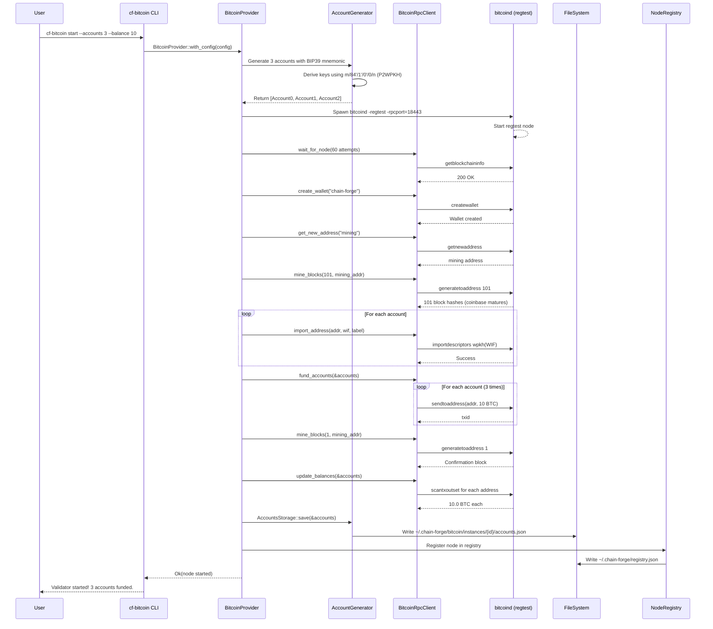
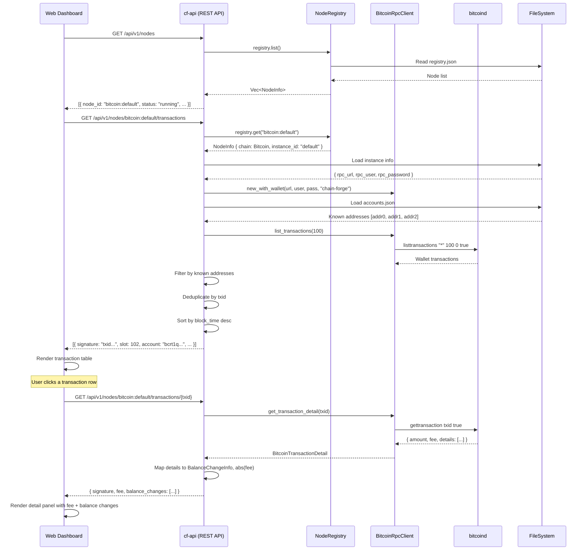

# Chain Forge Architecture Diagram

## High-Level System Overview

## Data Flow: Starting a Bitcoin Node with 3 Accounts

## Data Flow: Dashboard Viewing Transactions

## Component Responsibilities

### User Interfaces
- **Web Dashboard** (`development/dashboard/`): React SPA for visual node management. Auto-refreshes via React Query. Chain-aware UI (SOL/BTC units, Signature/TxID labels).
- **TypeScript Examples** (`examples/`): Demonstrate programmatic usage of the NPM package.

### API Layer
- **REST API Server** (`crates/api-server/`): Axum HTTP server. Unified endpoints for both chains. Powers the dashboard. Binary: `cf-api`, default port 3001.
- **@chain-forge/solana** (`npm/@chain-forge/solana/`): TypeScript client that spawns `cf-solana` CLI as a child process.

### CLI Binaries
- **cf-solana** (`chains/solana/crates/cli/`): Solana-specific CLI commands (start, accounts, fund, config, stop).
- **cf-bitcoin** (`chains/bitcoin/crates/cli/`): Bitcoin-specific CLI commands (start, accounts, fund, config, stop).

### Shared Infrastructure
- **Common** (`crates/common/`): `ChainProvider` trait, `ChainError` types, `NodeRegistry` for tracking nodes, `ChainType` enum, input validation.
- **Config** (`crates/config/`): TOML-based config with profiles, data directory management.
- **CLI Utils** (`crates/cli-utils/`): Output formatting (JSON/table).

### Chain Implementations
- **Solana** (`chains/solana/crates/`): accounts (BIP39/BIP44), rpc (solana-client wrapper), core (provider + validator lifecycle), cli.
- **Bitcoin** (`chains/bitcoin/crates/`): accounts (BIP39/BIP84 P2WPKH), rpc (bitcoincore-rpc wrapper), core (provider + bitcoind lifecycle), cli.

### External Systems
- **solana-test-validator**: Local Solana blockchain (port 8899 default).
- **bitcoind (regtest)**: Local Bitcoin blockchain (port 18443 default).
- **File System**: Account storage, node registry, instance info, config files under `~/.chain-forge/`.

## Communication Protocols

1. **Dashboard → API Server**: HTTP REST (port 5173 → port 3001 via Vite proxy)
2. **API Server → Chain RPC**: HTTP JSON-RPC (Solana port 8899, Bitcoin port 18443)
3. **TypeScript → Rust**: Child process spawn + stdio communication
4. **Rust → External Nodes**: HTTP RPC calls
5. **All components → File System**: JSON serialization for accounts, registry, instance info
