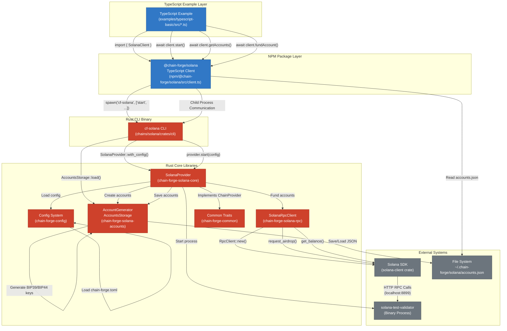
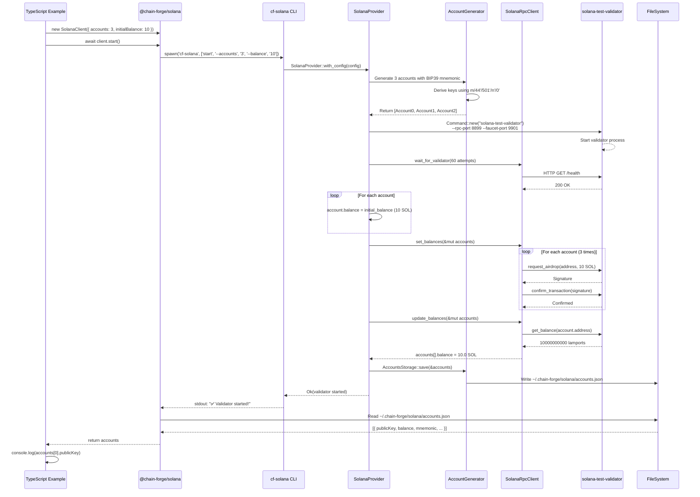

# Chain Forge Architecture Diagram

## Component Interaction Flow

## Data Flow Example: Starting a Validator with 3 Accounts

## Component Responsibilities

### TypeScript Layer
- **Example Applications**: Demonstrate usage patterns
- **@chain-forge/solana**: User-friendly API, process management, TypeScript types

### Rust Binary Layer
- **cf-solana CLI**: Command-line interface, argument parsing
- **SolanaProvider**: Orchestrates validator lifecycle, account management
- **SolanaRpcClient**: RPC communication with validator
- **AccountGenerator**: BIP39/BIP44 key derivation, cryptographic operations
- **AccountsStorage**: Persistence to/from JSON
- **Config**: TOML configuration loading

### External Systems
- **solana-test-validator**: Local Solana blockchain
- **Solana SDK**: Official RPC client library
- **File System**: Persistent account storage

## Communication Protocols

1. **TypeScript → Rust**: Child process spawn, stdio communication
2. **Rust → Validator**: HTTP RPC calls (localhost:8899)
3. **Rust → FileSystem**: JSON serialization/deserialization
4. **TypeScript → FileSystem**: Read accounts.json for client-side operations
